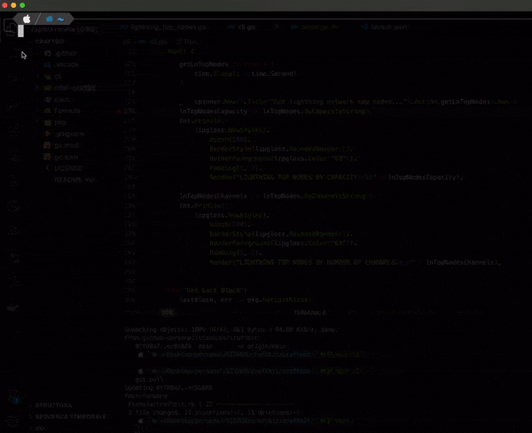

#  CRAFTBIT  
[](https://github.com/stackzoo/craftbit/actions/workflows/ci.yaml) [](https://goreportcard.com/report/github.com/stackzoo/craftbit)  
[](https://github.com/stackzoo/craftbit/releases/latest) [](https://opensource.org/licenses/MIT)  


<br/>
Bitcoin Swiss Army Knife 🪛 🌕 🔧

## Abstract
This software is a lightweight Command Line Interface (CLI) containing multiple utilities designed for interacting with the Bitcoin ecosystem.  
Most of these utilities either serve as wrappers for [*btcd*](https://github.com/btcsuite/btcd) libraries or make calls to the [*mempool.space REST APIs*](https://mempool.space/docs/api/rest).  

> [!WARNING] 
> As certain functions leverage the APIs of the public instance of **mempool.space**, this tool may be suboptimal from a privacy perspective and inadvertently expose personally identifiable information (PII) such as transactions or addresses.  

## Why CraftBit ?
This tool serves multiple purposes:

1. It consolidates various utilities for interacting with the *Bitcoin* ecosystem into a single executable.
2. It provides reusable atomic packages and functions, organized under the `pkg` folder.
3. It aims to serve as an educational aid for individuals new to the Bitcoin world.  


## How to install
### Homebrew
You can install craftib via *homebrew* with the following command:  
```console
brew tap stackzoo/craftbit https://github.com/stackzoo/craftbit && \
brew install craftbit
```  

### Releases
Go to the [*release*](https://github.com/stackzoo/craftbit/releases) page and download the binary for your OS.  


## Usage
  


